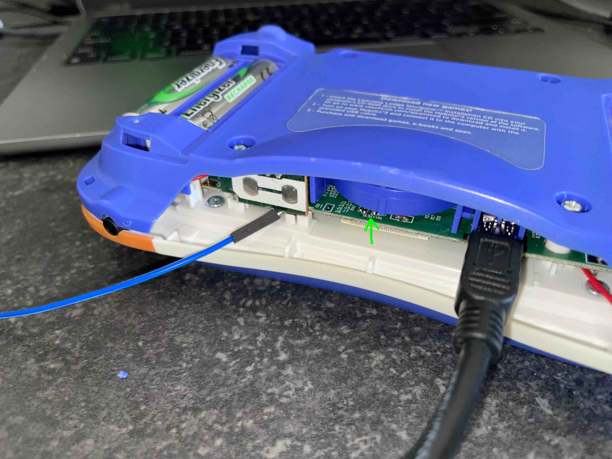
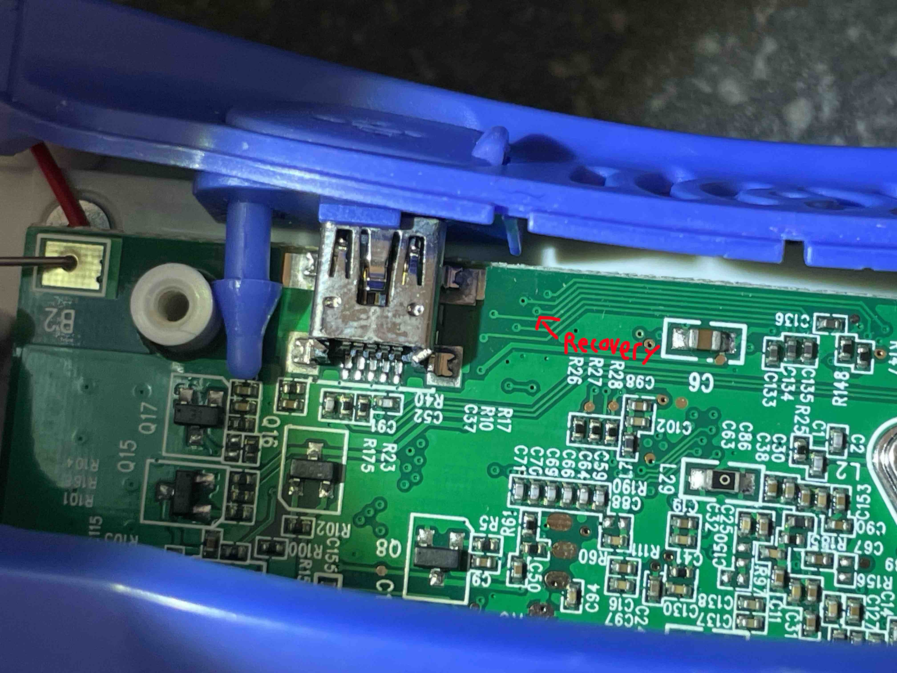

# How to unbrick the VTech Mobigo 2 (Recovery Mode)
hey welcome to the only thing on this site written by a human

you need a 3.3v source and a linux machine/vm with usb and a windows machine with Learning Lodge. this tutorial will be with debian based distros. but if you are running something other then that you probably know what you are doing.

so heres what to do if you brick your mobigo 2 (dont ask me how i know)

open your mobigo
Theres 8 screw in the back, 4 of them are under caps, 4 are under the batteries.
i recommend to not open it too much because its really easy to break stuff. (dont ask me how i know)
just like have the back case *slightly* off (if you pull to fast the speaker wire will break) enough that you can take out the plastic panel with the volume button and covers the usb port. You need to partaly close it again to get the batteries back in.

Now you are going to need a source of 3.3v and ground for this (preferably coming from the computer you will use for the usb, idk why but i needed that)

Connect ground to a ground inside the mobigo (external stuff like usb shield doesnt work). im using the side of the volume buttons pcb.
and then hold the 3.3v wire touching this side of this resistor (on the left of the text C136 on my revision 8 & 9 boards) 

while you have both wires connected. press on. if it shows a white screen then it worked, if it shows anything else like the mobigo logo then probably not.



Alternativly theres also a pad but its harder to reach



Now on the linux machine open terminal and type

```lsusb```
If the response does not contain a usb device with the ID of 1b3f:2050 then something is wrong. (i mean you can keep trying the next steps)

then run 
```ls -l /sys/block/sdc/device/scsi_generic/```

you should see something like
```drwxr-xr-x 3 root root 0 Aug  9 18:13 sg2```
for me it shows "sg2" but for you that can be anything, for the next command replace "sg2" with what you have there instead.

[download this script](../files/wipe_mobigo2_nand.sh)
run
```
chmod +x wipe_mobigo2_nand.sh
./wipe_mobigo2_nand.sh /dev/sg2
```

Now reboot your mobigo. You should hear the boot sound but see a black screen. Plug it into a windows machine running Learning Lodge and set it up in learning lodge. Tada! might take a few reboots and say firmware updating. 


if you need help friend maxniftynine on discord.